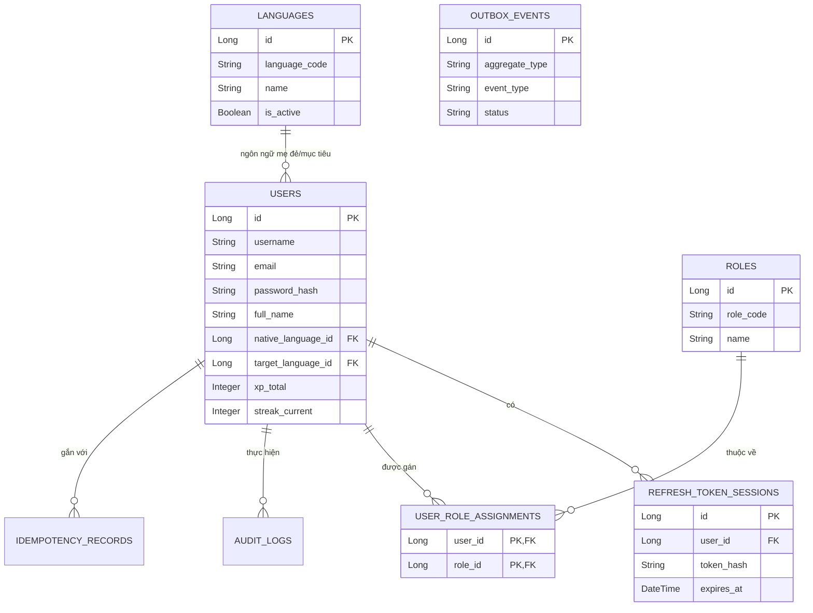
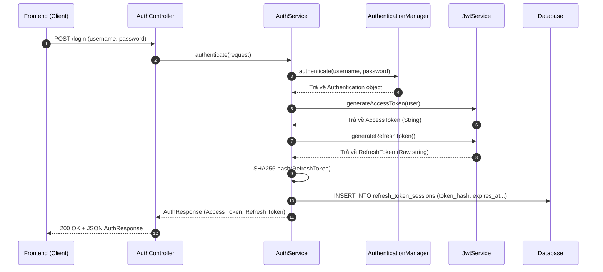

# Thiết kế Hệ thống Backend - Phân hệ Người A (Identity & Infrastructure)

Phân hệ Người A đóng vai trò là xương sống của hệ thống, bao gồm quản lý định danh (Users), phân quyền (Roles), phiên đăng nhập (Refresh Token), đa ngôn ngữ (Languages) và các cơ sở hạ tầng đảm bảo tính ổn định (AuditLog, Idempotency, Outbox).

## 1. Biểu đồ quan hệ thực thể (ERD)

Các bảng được phân công: `Language`, `Role`, `Users`, `UserRoleAssignment`, `RefreshTokenSession`, `AuditLog`, `OutboxEvent`, `IdempotencyRecord`.

## 2. Thiết kế chi tiết RESTful API

Tuân thủ kiến trúc RESTful, tích hợp OpenAPI/Swagger.

### 2.1 Nhóm Auth API (Public)
Quản lý phiên làm việc, cấp phát và thu hồi Token.

- **`POST /api/v1/auth/register`**
  - **Mô tả**: Đăng ký tài khoản người học mới.
  - **Payload**: `{ "username": "...", "email": "...", "password": "...", "fullName": "..." }`
  - **Logic**: Kiểm tra trùng lặp email/username -> Mã hóa bcrypt -> Lưu DB -> Gán role `LEARNER`. Trả về 201 Created.
- **`POST /api/v1/auth/login`**
  - **Mô tả**: Đăng nhập lấy token.
  - **Payload**: `{ "username": "...", "password": "..." }`
  - **Logic**: Xác thực qua AuthenticationManager. Khởi tạo AccessToken (1 giờ) và RefreshToken (7 ngày). Mã hóa RefreshToken qua SHA-256 rồi lưu vào `refresh_token_sessions`.
- **`POST /api/v1/auth/refresh`**
  - **Mô tả**: Xin cấp lại AccessToken mới.
  - **Payload**: `{ "refreshToken": "..." }`
  - **Logic**: So khớp mã băm trong cơ sở dữ liệu. Nếu chưa hết hạn, cấp AccessToken mới.
- **`POST /api/v1/auth/logout`**
  - **Mô tả**: Đăng xuất hệ thống.
  - **Header**: `Authorization: Bearer <token>`
  - **Logic**: Cập nhật `revoked_at` của phiên RefreshToken hiện hành trong CSDL.

### 2.2 Nhóm User Profile API (Protected)
Thao tác trên thông tin người dùng đang đăng nhập.

- **`GET /api/v1/users/me`**
  - **Mô tả**: Lấy thông tin cá nhân hiện tại.
  - **Logic**: Giải mã JWT lấy userId -> Truy vấn CSDL kèm thông tin Native/Target language.
- **`PUT /api/v1/users/me`**
  - **Mô tả**: Cập nhật thông tin profile.
  - **Payload**: Các trường cho phép cập nhật (`fullName`, `avatarUrl`, `timezone`, `dailyGoalCards`...).

### 2.3 Nhóm API Quản trị & Hệ thống (Admin)
- **`GET /api/v1/users`**: Danh sách toàn bộ User (Hỗ trợ Pagination, Sort).
- **`PUT /api/v1/users/{id}/status`**: Cập nhật trạng thái người dùng (Ví dụ: Khóa tài khoản).
- **`GET /api/v1/languages`**: Danh sách ngôn ngữ hệ thống đang hỗ trợ. (Public)
- **`GET /api/v1/roles`**: Danh sách các Roles đang có (Dùng để quản lý phân quyền).

## 3. Biểu đồ luồng xử lý Đăng nhập & Tạo JWT

## 4. Các cơ sở hạ tầng (Infrastructure) xử lý kỹ thuật

1. **Chống gọi trùng lặp (Idempotency API)**
   - **Bảng**: `idempotency_records`
   - **Cách hoạt động**: Một số API nhạy cảm yêu cầu client gửi kèm Header `Idempotency-Key`. Hệ thống dùng một AOP Interceptor để kiểm tra mã này trong CSDL. Nếu đã có thì không xử lý lại mà trả về ngay dữ liệu của lần trước (tăng tính an toàn mạng).
2. **Xử lý bất đồng bộ bằng Outbox Pattern**
   - **Bảng**: `outbox_events`
   - **Cách hoạt động**: Khi có sự kiện cần gọi tới hệ thống khác (vd gửi Email chào mừng lúc tạo User). Thay vì gửi email ngay trong luồng `register`, ứng dụng lưu event "UserRegistered" vào `outbox_events`. Một job `@Scheduled` chạy ngầm để lấy các event này đem đi xử lý, tránh bắt người dùng chờ lâu.
3. **Audit Log (Dấu vết kiểm toán)**
   - **Bảng**: `audit_logs`
   - **Cách hoạt động**: Dùng JPA `@EntityListeners` ghi nhận mọi hoạt động nhạy cảm (vd: Đổi mật khẩu, Khóa tài khoản) kèm địa chỉ IP và hành động vào bảng để theo dõi truy vết.

## 5. Chiến lược Kiểm thử (Testing)

Tuân thủ việc viết Test case sử dụng `JUnit 5` và `MockMvc`.
8 test case tối thiểu cần hoàn thiện cho phần này:
1. `POST /register`: Request hợp lệ -> Trả về 201 Created.
2. `POST /register`: Request trùng email -> Trả về 409 Conflict.
3. `POST /register`: Thiếu trường bắt buộc (Validation) -> Trả về 400 Bad Request.
4. `POST /login`: Đúng thông tin -> Trả về JWT Token.
5. `POST /login`: Sai mật khẩu -> Trả về 401 Unauthorized.
6. `POST /refresh`: Truyền RefreshToken hợp lệ -> Nhận lại Access Token mới.
7. `GET /users/me`: Có Bearer token hợp lệ -> Trả về 200 OK kèm thông tin cá nhân.
8. `GET /users`: Không có quyền Admin -> Trả về 403 Forbidden.
